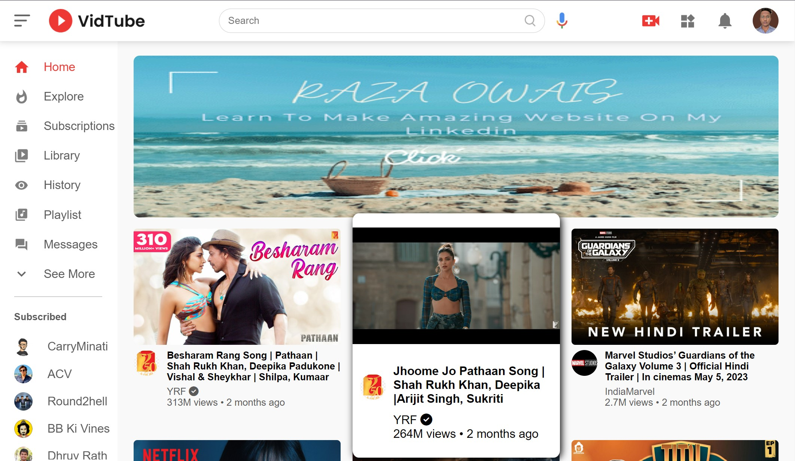
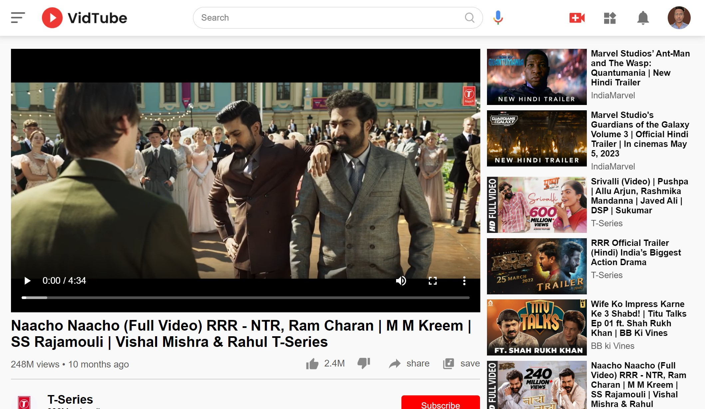

<h1>VidTube - YouTube Clone Frontend Project</h1>
<h4>This is a frontend project for a YouTube clone called VidTube. The project is built using JS, CSS and HTML, and it aims to replicate some of the core features and functionalities of YouTube.</h4>

<h3>Features<h3>
<ul>
<li>Watch videos</li>
<li>View video details such as title, description, uploader, and upload date</li>
<li>Like and dislike videos</li>
<li>comments to videos</li>
<li>Youtube hover effect</li>
<li>subsriptions</li>
</ul>

<h3>Installation</h3>
<ol>
<li>Clone the project repository from GitHub.</li>
<li>Open the index.html file in your web browser.</li>
<li>Click on a video to watch it.</li>
<li>Scroll down to view video details and comments.</li>
<li>Like or dislike the video using the thumbs up and thumbs down buttons.</li>
</ol>

<h3>Build With</h3>
<ul>
<li>HTML</li>
<li>CSS</li>
<li>Js</li>
</ul>

<h3>Live :</h3> https://owaisraza04.github.io/VidTube---A-Youtube-Clone/

